<!-- Generated by scripts/build.mjs. Edit profile.config.json, not this file. -->
<a href="https://www.deadpixeldesign.com/"></a>



 

<a href="https://github.com/wretcher207/reaper-daemon"></a> <a href="https://github.com/wretcher207/dead-pixel-design"></a>

<a href="https://github.com/wretcher207/post-mortem"></a> <a href="https://github.com/wretcher207/cab-rot-2"></a>

<a href="https://github.com/wretcher207/Dehumanizer-Pro"></a> <a href="https://github.com/wretcher207/claude-visualizer"></a>
